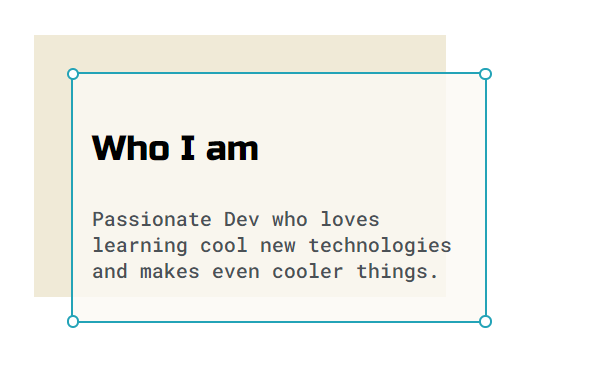

### 🏠 [Hosted Site](www.EthanMByrd.com)

  
  
  

A personal website to act as my portfolio and help explain who I am, how I work, and what I do.

## Author

👤 **Ethan Byrd**

* Website: www.ethanmbyrd.com
* Github: [@Ebyrd10](https://github.com/Ebyrd10)
* LinkedIn: [@Ethan-byrd](https://linkedin.com/in/Ethan-byrd)

## Support

Reach out to me at one of the following places!

- Website at <a href="http://www.Ethanmbyrd.com" target="_blank">`Ethanmbyrd.com`</a>
- LinkdenIn at <a href="https://www.linkedin.com/in/ethan-byrd/" target="_blank">`https://www.linkedin.com/in/ethan-byrd/`</a>

---

## License

- **[MIT license](http://opensource.org/licenses/mit-license.php)**
